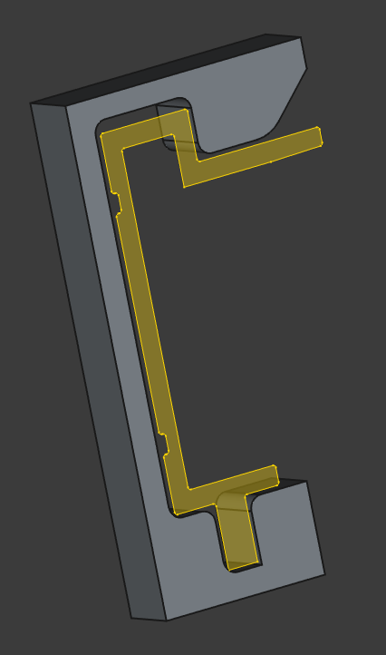

# Sovol SV08 Top Rail Clip

This repository contains STEP and FreeCAD files for clips that fit on the top rails of the Sovol SV08 printer.

## v1 vs v2

> **NOTE:** If features are added to the outer face they must not interfere with the flexibility of said face. This clip requires some flexibility to snap into place. Print test pieces first!

* v1 - Tighter tolerances.
    - Does not slide easily on the frame.
    - Tested up to 50mm wide.
    - Top angles upwards slightly (0.4mm)
    - Outward facing face will bow, top may not be level.
* v2 - Looser tolerances.
    - Slides on the frame somewhat easily
    - Tested up to 60mm wide.
    - Outward facing face will not bow, top is *mostly* level
